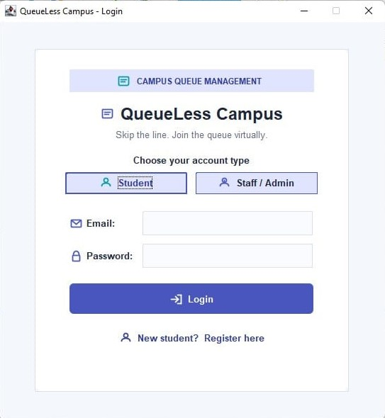
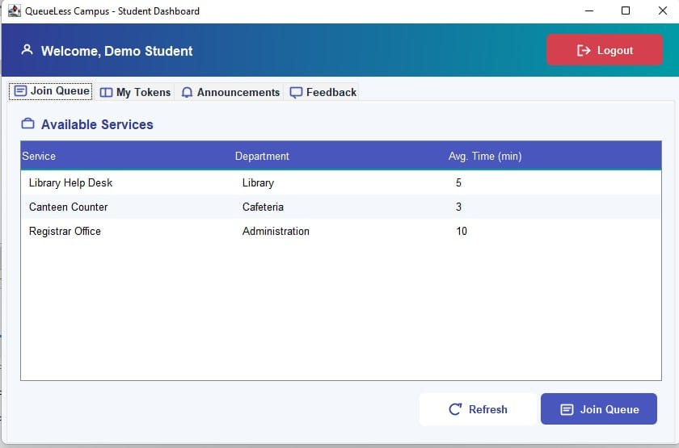
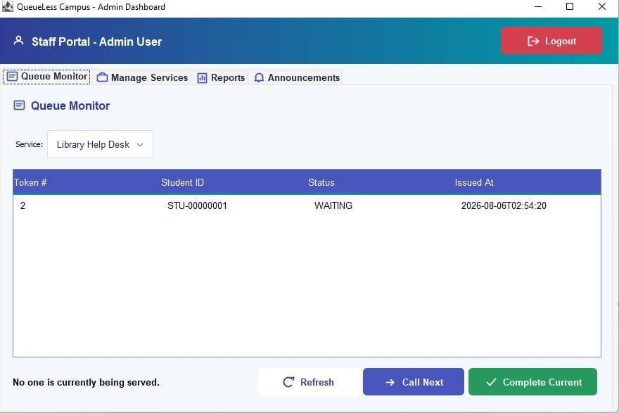

# QueueLess Campus

## Introduction

QueueLess Campus is a Java Swing desktop application designed to replace long, unmanaged physical queues at university service points with a virtual first-come-first-served (FIFO) token queue system.

The system is designed for campus services such as the library desk, canteen counter, registrar/admission office, and other service points. Students can register or log in, browse active services, join a queue, receive a token number, monitor their queue position, and cancel a waiting token when necessary.

Staff and administrators can manage queues, call the next student, complete tokens, manage services, view service statistics, export reports, and publish campus-wide announcements.

The application is developed entirely in Java SE 17 using Java Swing and standard Java libraries, with CSV files used for persistent storage.

### Technology

* Java SE 17+
* Java Swing
* Java Collections Framework
* `java.time`
* `java.nio.file`
* CSV-based file persistence
* Strict **View → Controller → Service → Storage** architecture

No external libraries are required.


Project Structure

```text
QueueLess-Campus/
├── src/
│   ├── model/
│   ├── view/
│   │   ├── student/
│   │   ├── admin/
│   │   └── shared/
│   ├── controller/
│   ├── service/
│   ├── storage/
│   ├── util/
│   └── Main.java
└── data/
```

The application separates domain models, UI, controllers, business logic, storage, and utility classes to maintain a clean modular structure.

---

## Key Features

### Student Features

* Student registration and login
* Browse currently active campus services
* Join a virtual queue and receive a token number
* View live queue position
* Cancel a waiting token
* View token status
* Read campus announcements
* Submit service feedback and ratings

### Staff/Admin Features

* Staff/Admin login
* View and monitor service queues
* Call the next student using FIFO queue management
* Mark the currently served token as completed
* Add new campus services
* Activate or deactivate services
* View service usage reports
* Track issued, completed, and cancelled tokens
* View average waiting time
* Export reports to CSV
* Publish campus-wide announcements

### Technical Features

* Queue management using Java's `Queue<Token>` with `LinkedList`
* Separate queue maintained for each service
* CSV-based persistent storage
* Role-based dashboards and access
* Input validation and defensive exception handling
* Modular MVC-style layered architecture
* UUID-derived unique IDs for entities
* Consistent UI through shared Swing utilities
* Session-based notifications for queue events

The project follows a strict View → Controller → Service → Storage data flow, keeping UI, business logic, and persistence separated.

### Screenshots

#### Login Screen


#### Student Dashboard


#### Admin Dashboard



##  Team Task Distribution

The project was developed by a five-member team, with each member responsible for a specific module while collaborating on integration and code review.

| Team Member                | Assigned Task                                                                                                   |
| -------------------------- | --------------------------------------------------------------------------------------------------------------- |
| **Adiba Tasnim Chowdhury** | Architecture, authentication, core models, `Main.java`, login system, validation utilities, and README          |
| **Reyana Islam**           | Queue management system, `QueueManager`, `NotificationManager`, and `ServiceManager`                            |
| **Anika Nahar**            | Student module, student dashboard, queue joining, token tracking, announcements, and feedback UI                |
| **Ariya Rahman Tuba**      | Admin module, admin dashboard, queue monitoring, service management, reporting, and announcements               |
| **Nusrat Jiban Mim**       | Storage layer, CSV repositories, shared UI utilities, CSV export, data seed files, and final system integration |

Detailed implementation ownership is documented in the project report.

The team also followed a GitHub-based workflow using separate feature branches, pull requests, code reviews, and conflict resolution before merging modules into the main project.

---

##  Citation & Report

### Project Report

QueueLess Campus — Mini Lab Project Report
Course: CSE222 — Object-Oriented Programming
Department of Computer Science and Engineering
Daffodil International University

Report Drive Link: https://drive.google.com/file/d/1JCBTfZjNeGx3jbc-W4vRh8dJTtody4ml/view?usp=drive_link

### Citation 

The project report references the following sources:

1. Oracle Corporation. *The Java Tutorials — Object-Oriented Programming Concepts and the Collections Framework*, 2024.
2. Oracle Corporation. *Java Platform, Standard Edition Swing Tutorial*, 2024.
3. Erich Gamma, Richard Helm, Ralph Johnson, and John Vlissides. *Design Patterns: Elements of Reusable Object-Oriented Software*. Addison-Wesley, 1994.

---

## Instructor

**Md. Mezbaul Islam Zion**

Lecturer

Department of Computer Science and Engineering
Daffodil International University

The project was completed under his supervision as part of CSE222: Object-Oriented Programming.


